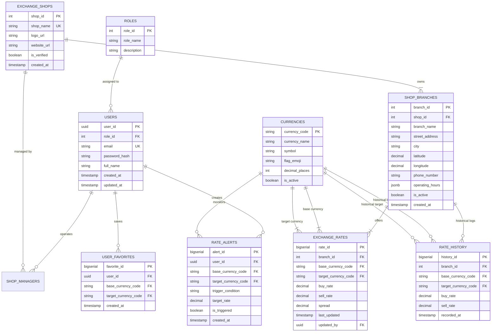

# Database Design Specification

## Easy Exchange — Currency Exchange Comparison Web App

**Document Version:** 1.0.0  
**Status:** Approved  
**Date:** September 2026  
**Target RDBMS:** PostgreSQL 15+ (with PostGIS or Lat/Lng Spatial Extension)  
**Authors:**  
* Ye Zayar Aung (Avax) — `6705140012`  
* Paing Thu Kha Kyaw (Flexx) — `6705140018`  
* Aung Chan Myae (Rowan) — `6705140035`  
**Repository Path:** `Lab_Agile/docs/database_design.md`  

---

## 1. Overview & Architecture Selection

The **Easy Exchange** system relies on a relational database architecture to maintain absolute transactional integrity, real-time rate accuracy, and support low-latency geospatial proximity queries.

### 1.1 RDBMS Selection: PostgreSQL
* **ACID Compliance:** Ensures monetary and rate updates are never partially committed.
* **Spatial Support:** Native geospatial indexing (PostGIS / GiST indexes or Haversine function indexes) for sub-millisecond "Near Me" radius queries.
* **JSONB Capabilities:** Enables flexible storage for semi-structured data such as shop weekly operating hours and payment method flags without rigid table overhead.
* **Auditability:** Supports robust trigger-based historical snapshots for rate tracking.

---

## 2. Entity-Relationship (ER) Diagram

The following Mermaid diagram visualizes the relational schema and cardinality between entities:



---

## 3. Data Dictionary

### 3.1 Table: `roles`
Stores role permissions within the platform.

| Column | Data Type | Nullable | Default | Constraints | Description |
| :--- | :--- | :--- | :--- | :--- | :--- |
| `role_id` | `INT` | No | Serial | Primary Key | Unique role identifier. |
| `role_name` | `VARCHAR(30)` | No | — | Unique | Role name: `'admin'`, `'shop_manager'`, `'customer'`. |
| `description` | `VARCHAR(255)`| Yes| NULL | — | Explanation of role permissions. |

---

### 3.2 Table: `users`
Registered users, platform admins, and authorized shop operators.

| Column | Data Type | Nullable | Default | Constraints | Description |
| :--- | :--- | :--- | :--- | :--- | :--- |
| `user_id` | `UUID` | No | `gen_random_uuid()` | Primary Key | Unique user identifier. |
| `role_id` | `INT` | No | 3 | FK -> `roles(role_id)` | Role reference. |
| `email` | `VARCHAR(255)`| No | — | Unique | User login and notification email. |
| `password_hash`| `VARCHAR(255)`| No| — | — | Argon2id or Bcrypt hash. |
| `full_name` | `VARCHAR(100)`| No | — | — | User's full name. |
| `is_active` | `BOOLEAN` | No | `true` | — | Account active status flag. |
| `created_at` | `TIMESTAMPTZ` | No | `CURRENT_TIMESTAMP` | — | Account registration time. |
| `updated_at` | `TIMESTAMPTZ` | No | `CURRENT_TIMESTAMP` | — | Last modification time. |

---

### 3.3 Table: `exchange_shops`
Master table of currency exchange brands / companies.

| Column | Data Type | Nullable | Default | Constraints | Description |
| :--- | :--- | :--- | :--- | :--- | :--- |
| `shop_id` | `SERIAL` | No | Serial | Primary Key | Unique shop brand identifier. |
| `shop_name` | `VARCHAR(100)`| No | — | Unique | Brand name (e.g., `'SuperRich Thailand'`, `'Vasu Exchange'`). |
| `logo_url` | `VARCHAR(500)`| Yes| NULL | — | Brand logo asset URI. |
| `website_url`| `VARCHAR(500)`| Yes| NULL | — | Official website URL. |
| `is_verified`| `BOOLEAN` | No | `false` | — | Verification badge flag. |
| `created_at` | `TIMESTAMPTZ` | No | `CURRENT_TIMESTAMP` | — | Record creation time. |

---

### 3.4 Table: `shop_branches`
Physical counters and kiosk locations.

| Column | Data Type | Nullable | Default | Constraints | Description |
| :--- | :--- | :--- | :--- | :--- | :--- |
| `branch_id` | `SERIAL` | No | Serial | Primary Key | Unique physical branch identifier. |
| `shop_id` | `INT` | No | — | FK -> `exchange_shops(shop_id)` | Parent exchange shop brand. |
| `branch_name`| `VARCHAR(150)`| No | — | — | Branch name (e.g., `'Head Office Rajdamri'`, `'Asok BTS'`). |
| `street_address`| `TEXT` | No | — | — | Full street address. |
| `city` | `VARCHAR(100)`| No | `'Bangkok'` | — | Municipality / city. |
| `latitude` | `DECIMAL(10,8)`| No | — | Check (-90 to 90) | GPS Latitude coordinate. |
| `longitude` | `DECIMAL(11,8)`| No | — | Check (-180 to 180) | GPS Longitude coordinate. |
| `phone_number`| `VARCHAR(50)` | Yes| NULL | — | Customer contact number. |
| `operating_hours`| `JSONB` | No | `'{}'::jsonb` | — | Structured schedule (open/close times per day). |
| `is_active` | `BOOLEAN` | No | `true` | — | Operating branch status flag. |
| `created_at` | `TIMESTAMPTZ` | No | `CURRENT_TIMESTAMP` | — | Branch registration time. |

---

### 3.5 Table: `currencies`
ISO 4217 standard currency codes.

| Column | Data Type | Nullable | Default | Constraints | Description |
| :--- | :--- | :--- | :--- | :--- | :--- |
| `currency_code` | `VARCHAR(3)` | No | — | Primary Key | ISO 4217 uppercase 3-letter code (e.g., `'USD'`). |
| `currency_name` | `VARCHAR(50)` | No | — | — | Full currency name (e.g., `'United States Dollar'`). |
| `symbol` | `VARCHAR(10)` | No | — | — | Currency symbol (e.g., `'$'`, `'฿'`, `'€'`). |
| `flag_emoji` | `VARCHAR(10)` | Yes| NULL | — | Country flag emoji (e.g., `'🇺🇸'`). |
| `decimal_places`| `SMALLINT` | No | 2 | — | Standard decimal places. |
| `is_active` | `BOOLEAN` | No | `true` | — | Active trading currency flag. |

---

### 3.6 Table: `exchange_rates`
Current active exchange rates offered at each branch.

| Column | Data Type | Nullable | Default | Constraints | Description |
| :--- | :--- | :--- | :--- | :--- | :--- |
| `rate_id` | `BIGSERIAL` | No | Serial | Primary Key | Unique rate entry ID. |
| `branch_id` | `INT` | No | — | FK -> `shop_branches(branch_id)` | Counter location offering rate. |
| `base_currency_code`| `VARCHAR(3)`| No | — | FK -> `currencies(currency_code)` | Currency being exchanged. |
| `target_currency_code`| `VARCHAR(3)`| No | `'THB'` | FK -> `currencies(currency_code)` | Target currency received. |
| `buy_rate` | `DECIMAL(12,4)`| No | — | Check (> 0) | Rate at which counter buys base currency. |
| `sell_rate` | `DECIMAL(12,4)`| No | — | Check (> 0) | Rate at which counter sells base currency. |
| `spread` | `DECIMAL(12,4)`| GENERATED | `sell_rate - buy_rate` | Check (>= 0) | Automatic calculated shop margin. |
| `last_updated` | `TIMESTAMPTZ` | No | `CURRENT_TIMESTAMP` | — | Last rate update timestamp. |
| `updated_by` | `UUID` | Yes| NULL | FK -> `users(user_id)` | Authenticated user who edited rate. |

---

### 3.7 Table: `rate_history`
Audit and analytical time-series logs of historical rates.

| Column | Data Type | Nullable | Default | Constraints | Description |
| :--- | :--- | :--- | :--- | :--- | :--- |
| `history_id` | `BIGSERIAL` | No | Serial | Primary Key | Log event ID. |
| `branch_id` | `INT` | No | — | FK -> `shop_branches(branch_id)` | Counter location. |
| `base_currency_code` | `VARCHAR(3)` | No | — | FK -> `currencies(currency_code)` | Base currency. |
| `target_currency_code` | `VARCHAR(3)` | No | — | FK -> `currencies(currency_code)` | Target currency. |
| `buy_rate` | `DECIMAL(12,4)` | No | — | — | Recorded buy rate. |
| `sell_rate` | `DECIMAL(12,4)` | No | — | — | Recorded sell rate. |
| `recorded_at` | `TIMESTAMPTZ` | No | `CURRENT_TIMESTAMP` | — | Snapshot creation timestamp. |

---

## 4. Indexing & Optimization Strategy

To ensure queries return in under 200 ms under high concurrent load:

1. **Unique Active Rate Index:**
   ```sql
   CREATE UNIQUE INDEX idx_unique_active_branch_rate 
   ON exchange_rates (branch_id, base_currency_code, target_currency_code);
   ```
   *Prevents duplicate rate rows per currency pair per branch; enables high-speed `UPSERT` operations.*

2. **Spatial Coordinate Index:**
   ```sql
   CREATE INDEX idx_shop_branches_lat_lng 
   ON shop_branches (latitude, longitude) 
   WHERE is_active = true;
   ```
   *Accelerates bounding-box and Haversine distance computations for "Find Near Me" queries.*

3. **Time-Series Rate History Index:**
   ```sql
   CREATE INDEX idx_rate_history_pair_time 
   ON rate_history (base_currency_code, target_currency_code, recorded_at DESC);
   ```
   *Optimizes retrieval of 7-day and 30-day historical exchange rate sparklines.*

4. **Foreign Key Performance Indexes:**
   ```sql
   CREATE INDEX idx_exchange_rates_branch ON exchange_rates (branch_id);
   CREATE INDEX idx_shop_branches_shop ON shop_branches (shop_id);
   ```

---

## 5. SQL DDL Implementation Script

```sql
-- Easy Exchange Database DDL Specification
-- Target: PostgreSQL 15+

CREATE EXTENSION IF NOT EXISTS "uuid-ossp";

-- 1. Roles
CREATE TABLE roles (
    role_id SERIAL PRIMARY KEY,
    role_name VARCHAR(30) NOT NULL UNIQUE,
    description VARCHAR(255)
);

INSERT INTO roles (role_name, description) VALUES 
('admin', 'Full platform administrator'),
('shop_manager', 'Manager of specific exchange shop branches'),
('customer', 'Public registered user');

-- 2. Users
CREATE TABLE users (
    user_id UUID PRIMARY KEY DEFAULT gen_random_uuid(),
    role_id INT NOT NULL REFERENCES roles(role_id),
    email VARCHAR(255) NOT NULL UNIQUE,
    password_hash VARCHAR(255) NOT NULL,
    full_name VARCHAR(100) NOT NULL,
    is_active BOOLEAN NOT NULL DEFAULT true,
    created_at TIMESTAMPTZ NOT NULL DEFAULT CURRENT_TIMESTAMP,
    updated_at TIMESTAMPTZ NOT NULL DEFAULT CURRENT_TIMESTAMP
);

-- 3. Currencies (ISO 4217)
CREATE TABLE currencies (
    currency_code VARCHAR(3) PRIMARY KEY,
    currency_name VARCHAR(50) NOT NULL,
    symbol VARCHAR(10) NOT NULL,
    flag_emoji VARCHAR(10),
    decimal_places SMALLINT NOT NULL DEFAULT 2,
    is_active BOOLEAN NOT NULL DEFAULT true
);

-- 4. Exchange Shops (Brands)
CREATE TABLE exchange_shops (
    shop_id SERIAL PRIMARY KEY,
    shop_name VARCHAR(100) NOT NULL UNIQUE,
    logo_url VARCHAR(500),
    website_url VARCHAR(500),
    is_verified BOOLEAN NOT NULL DEFAULT false,
    created_at TIMESTAMPTZ NOT NULL DEFAULT CURRENT_TIMESTAMP
);

-- 5. Shop Branches (Physical Locations)
CREATE TABLE shop_branches (
    branch_id SERIAL PRIMARY KEY,
    shop_id INT NOT NULL REFERENCES exchange_shops(shop_id) ON DELETE CASCADE,
    branch_name VARCHAR(150) NOT NULL,
    street_address TEXT NOT NULL,
    city VARCHAR(100) NOT NULL DEFAULT 'Bangkok',
    latitude DECIMAL(10,8) NOT NULL CHECK (latitude BETWEEN -90 AND 90),
    longitude DECIMAL(11,8) NOT NULL CHECK (longitude BETWEEN -180 AND 180),
    phone_number VARCHAR(50),
    operating_hours JSONB NOT NULL DEFAULT '{}'::jsonb,
    is_active BOOLEAN NOT NULL DEFAULT true,
    created_at TIMESTAMPTZ NOT NULL DEFAULT CURRENT_TIMESTAMP
);

-- 6. Current Active Exchange Rates
CREATE TABLE exchange_rates (
    rate_id BIGSERIAL PRIMARY KEY,
    branch_id INT NOT NULL REFERENCES shop_branches(branch_id) ON DELETE CASCADE,
    base_currency_code VARCHAR(3) NOT NULL REFERENCES currencies(currency_code),
    target_currency_code VARCHAR(3) NOT NULL DEFAULT 'THB' REFERENCES currencies(currency_code),
    buy_rate DECIMAL(12,4) NOT NULL CHECK (buy_rate > 0),
    sell_rate DECIMAL(12,4) NOT NULL CHECK (sell_rate > 0),
    spread DECIMAL(12,4) GENERATED ALWAYS AS (sell_rate - buy_rate) STORED,
    last_updated TIMESTAMPTZ NOT NULL DEFAULT CURRENT_TIMESTAMP,
    updated_by UUID REFERENCES users(user_id) ON DELETE SET NULL,
    CONSTRAINT chk_spread_positive CHECK (sell_rate >= buy_rate)
);

-- 7. Rate History Snapshot Log
CREATE TABLE rate_history (
    history_id BIGSERIAL PRIMARY KEY,
    branch_id INT NOT NULL REFERENCES shop_branches(branch_id) ON DELETE CASCADE,
    base_currency_code VARCHAR(3) NOT NULL REFERENCES currencies(currency_code),
    target_currency_code VARCHAR(3) NOT NULL REFERENCES currencies(currency_code),
    buy_rate DECIMAL(12,4) NOT NULL,
    sell_rate DECIMAL(12,4) NOT NULL,
    recorded_at TIMESTAMPTZ NOT NULL DEFAULT CURRENT_TIMESTAMP
);

-- 8. Performance Indexes
CREATE UNIQUE INDEX idx_unique_active_branch_rate 
ON exchange_rates (branch_id, base_currency_code, target_currency_code);

CREATE INDEX idx_shop_branches_lat_lng 
ON shop_branches (latitude, longitude) 
WHERE is_active = true;

CREATE INDEX idx_rate_history_pair_time 
ON rate_history (base_currency_code, target_currency_code, recorded_at DESC);
```

---

## 6. Seed Data Fixtures

```sql
-- Currencies Seed
INSERT INTO currencies (currency_code, currency_name, symbol, flag_emoji, decimal_places) VALUES
('THB', 'Thai Baht', '฿', '🇹🇭', 2),
('USD', 'United States Dollar', '$', '🇺🇸', 2),
('EUR', 'Euro', '€', '🇪🇺', 2),
('JPY', 'Japanese Yen', '¥', '🇯🇵', 2),
('GBP', 'British Pound Sterling', '£', '🇬🇧', 2),
('SGD', 'Singapore Dollar', 'S$', '🇸🇬', 2),
('CNY', 'Chinese Yuan', '¥', '🇨🇳', 2),
('MMK', 'Myanmar Kyat', 'Ks', '🇲🇲', 2);

-- Exchange Shops Seed
INSERT INTO exchange_shops (shop_name, logo_url, website_url, is_verified) VALUES
('SuperRich Thailand (Green)', 'https://assets.easyexchange.local/logos/superrich-green.png', 'https://www.superrichthailand.com', true),
('SuperRich 1965 (Orange)', 'https://assets.easyexchange.local/logos/superrich-orange.png', 'https://www.superrich1965.com', true),
('Vasu Exchange', 'https://assets.easyexchange.local/logos/vasu.png', 'http://www.vasuexchange.com', true),
('Siam Exchange', 'https://assets.easyexchange.local/logos/siam-exchange.png', 'https://www.siamexchange.co.th', true);

-- Branches Seed
INSERT INTO shop_branches (shop_id, branch_name, street_address, city, latitude, longitude, phone_number, operating_hours) VALUES
(1, 'Head Office Rajdamri 1', '45-45/1-2 Rajdamri 1 Rd, Lumphini, Pathum Wan', 'Bangkok', 13.74825000, 100.54122000, '+66 2 254 4444', 
 '{"mon_fri": "09:00-18:00", "sat": "09:30-17:00", "sun": "closed"}'::jsonb),
(2, 'BTS Asok Station Kiosk', 'BTS Asok Station Skywalk Concourse, Khlong Toei', 'Bangkok', 13.73711000, 100.56034000, '+66 2 654 3210', 
 '{"mon_sun": "10:00-20:00"}'::jsonb),
(3, 'Vasu Sukhumvit Soi 7/1', 'Sukhumvit Rd, Khlong Toei Nuea, Watthana (BTS Nana)', 'Bangkok', 13.74088000, 100.55523000, '+66 2 251 1855', 
 '{"mon_fri": "09:00-18:00", "sat": "09:00-17:00", "sun": "closed"}'::jsonb),
(4, 'Siam Exchange Counter', '422/3 Phaya Thai Rd, Wang Mai, Pathum Wan (BTS National Stadium)', 'Bangkok', 13.74712000, 100.53045000, '+66 2 215 3054', 
 '{"mon_fri": "09:30-18:30", "sat": "09:30-15:30", "sun": "closed"}'::jsonb);

-- Initial Rates Seed (USD / EUR / JPY to THB)
INSERT INTO exchange_rates (branch_id, base_currency_code, target_currency_code, buy_rate, sell_rate) VALUES
(1, 'USD', 'THB', 36.4500, 36.5500),
(1, 'EUR', 'THB', 39.8000, 39.9500),
(1, 'JPY', 'THB', 0.2450, 0.2470),
(2, 'USD', 'THB', 36.4000, 36.5800),
(2, 'EUR', 'THB', 39.7500, 40.0000),
(3, 'USD', 'THB', 36.4800, 36.5300),
(3, 'EUR', 'THB', 39.8200, 39.9200),
(4, 'USD', 'THB', 36.4600, 36.5400),
(4, 'JPY', 'THB', 0.2455, 0.2468);
```
