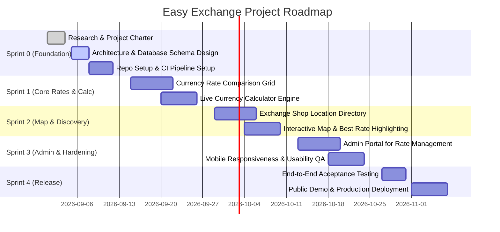

# Project Charter: Easy Exchange

**Project Name:** Easy Exchange — Currency Exchange Comparison Web App  
**Document Version:** 1.0.0  
**Status:** Approved  
**Date:** September 2026  
**Repository Path:** `Lab_Agile/docs/project_charter.md`  

---

## 1. Executive Summary

**Easy Exchange** is a web-based financial utility platform designed to solve the friction, ambiguity, and time consumption that students, international travelers, and expatriates experience when exchanging foreign currency. By aggregating and displaying live, side-by-side exchange rates from multiple independent currency exchange providers, highlighting best-rate opportunities, providing a dynamic calculation simulator, and presenting physical counter locations via an interactive map, Easy Exchange empowers consumers to make informed, cost-effective currency decisions in seconds.

---

## 2. Project Team & Governance

| Name | Student ID | Role | Responsibilities |
| :--- | :--- | :--- | :--- |
| **Ye Zayar Aung (Avax)** | `6705140012` | **Product Owner / Project Lead** | Vision roadmap, backlog grooming, stakeholder alignment, user story sign-off |
| **Paing Thu Kha Kyaw (Flexx)** | `6705140018` | **Scrum Master / Backend Lead** | Agile ceremonies, sprint delivery, database architecture, API & data ingestion |
| **Aung Chan Myae (Rowan)** | `6705140035` | **Tech Lead / Frontend Lead** | UI/UX implementation, client-side state, map integration, responsive web app |

---

## 3. Background & Business Problem

Based on the preliminary **Design Thinking Lab** research:

### 3.1 Empathize Findings
* **Rate Comparison Difficulty:** Money exchange shops publish rates on disconnected boards or fragmented websites. Students and travelers find it exhausting to compare rates manually across physical shops.
* **Calculation Confusion:** Currency exchange rates involve complex buy/sell spreads, denomination-specific pricing, and service commissions. Users struggle to calculate the net payout they will actually receive.
* **Finding Convenient Locations:** Users often settle for inferior airport or hotel rates simply because they do not know that a competitive shop is a 5-minute walk away.
* **Time Consumption:** Manually traveling or checking numerous shop websites creates severe cognitive overhead and delays travel schedules.

### 3.2 Define Statements
* *Currency exchangers need an easy way to compare rates* because shop spreads vary substantially even within the same commercial district.
* *Users need a simple, real-time currency calculator* because manual math errors lead to unexpected financial losses.
* *Students and travelers need convenient exchange shop locations* so they can visit reputable shops without excessive transit or search time.

---

## 4. Project Vision & Objectives

### 4.1 Vision Statement
To establish Easy Exchange as the leading, trusted, and effortless exchange rate comparison portal that guarantees students and global travelers receive the best possible value for their money without hidden surprises.

### 4.2 SMART Project Objectives
1. **Aggregated Comparison (Specific):** Provide side-by-side buy and sell rate comparisons for at least 8 major currencies across top physical exchange providers.
2. **Speed & Efficiency (Measurable):** Reduce user time spent finding the best local exchange rate from an average of 25 minutes to under 60 seconds.
3. **Accuracy (Achievable):** Maintain rate accuracy with automated or vendor-verified rate timestamps refreshed at least twice daily during business hours.
4. **Target Demographic Fit (Relevant):** Provide a mobile-first, zero-friction interface optimized for university students and international travelers.
5. **Agile Milestone Delivery (Time-bound):** Complete MVP development, testing, and deployment across 4 two-week Agile Sprints.

---

## 5. Scope of Work

```
                               +-------------------------------------+
                               |          Easy Exchange Core         |
                               +-------------------------------------+
                                                  |
         +------------------------+---------------+------------------------+
         |                        |                                        |
+------------------+    +--------------------+                   +--------------------+
|  In-Scope (MVP)  |    |  In-Scope (Rel 2)  |                   |    Out-of-Scope    |
+------------------+    +--------------------+                   +--------------------+
| - Rate Matrix    |    | - Rate Alerts      |                   | - In-App Banking   |
| - Best Rate Tag  |    | - Historical Chart |                   | - P2P Money Wire   |
| - Live Calc      |    | - User Reviews     |                   | - Physical Delivery|
| - Shop Map & GPS |    | - Multi-language   |                   | - Crypto Trading   |
+------------------+    +--------------------+                   +--------------------+
```

### 5.1 In-Scope (MVP & Release 1)
* **Real-Time Rate Comparison Table:** Displaying buy/sell rates for chosen currency pairs across multiple shops (e.g., SuperRich, Vasu, Siam Exchange, Bank kiosks).
* **Best Rate Finder Engine:** Algorithmic badge identifying the most favorable shop for buying or selling a specific currency.
* **Interactive Currency Calculator:** Instant conversion tool factoring in shop-specific rates and transaction amounts.
* **Exchange Shop Finder & Map:** Leaflet/Mapbox/OpenStreetMap integration highlighting nearby physical branches, opening hours, contact numbers, and navigation links.
* **Shop & Rate Administration:** Admin dashboard for verifying exchange shops and updating daily rate sheets.
* **Responsive Web Application:** Mobile-optimized layout suitable for smartphones and desktop browsers.

### 5.2 Planned Future Scope (Release 2)
* Automated email/push alerts when a currency reaches a target rate.
* Historical exchange rate trend charts (7-day / 30-day).
* User community reviews and counter wait-time indicators.
* Multi-language localization (English, Thai, Burmese, Chinese, Japanese).

### 5.3 Out-of-Scope (Explicit Non-Goals)
* Direct in-app banking transactions, money transfers, or financial escrow.
* Digital wallet balances or physical cash delivery services.
* Cryptocurrency or securities trading.
* Financial advisory or investment speculation services.

---

## 6. Key Stakeholders

| Stakeholder Group | Interests & Expectations | Impact / Priority |
| :--- | :--- | :--- |
| **International Students** | Affordable rates, transparent calculator, near-campus exchange shops. | High (Primary User) |
| **Tourists & Travelers** | Fast navigation, mobile ease, English language support, reliable hours. | High (Primary User) |
| **Exchange Shop Vendors** | Visibility to travelers, accurate listing of branches and rates. | Medium (Data Partner) |
| **Academic Evaluators** | Adherence to Agile methodologies, documentation rigor, code quality. | High (Governance) |
| **Development Team** | Maintainable architecture, automated tests, clear acceptance criteria. | High (Execution) |

---

## 7. Agile Roadmap & Sprint Milestones

The project will follow the Scrum framework across 4 two-week Sprints:



* **Sprint 0 (Week 1–2):** Project Charter, Software Requirements Specification, Database Design, Git Repository initialization, CI/CD setup.
* **Sprint 1 (Week 3–4):** Database migrations, rate comparison API, side-by-side table UI, interactive currency calculator.
* **Sprint 2 (Week 5–6):** Shop location catalog, Mapbox/Leaflet map integration, geolocation query ("Near Me"), best-rate algorithm.
* **Sprint 3 (Week 7–8):** Admin portal for rate ingestion, branch management, security authentication, performance optimizations.
* **Sprint 4 (Week 9–10):** Acceptance testing, usability testing with student test users, bug fixes, final production deployment.

---

## 8. Assumptions, Constraints & Dependencies

### 8.1 Assumptions
1. Exchange rates can be sourced reliably through verified daily rate uploads, public exchange feeds, or authorized shop staff updates.
2. Users have standard modern mobile or desktop web browsers supporting HTML5 Geolocation API.
3. The majority of physical exchange shops maintain consistent physical operating hours and cash stock.

### 8.2 Constraints
1. **Academic Timeline:** Complete delivery within the designated semester schedule.
2. **Budget:** Utilizing open-source tools (PostgreSQL, React, Node.js/Express, Leaflet / OpenStreetMap) and free-tier cloud hosting (e.g., Vercel, Render, Supabase).
3. **Data Availability:** Without direct banking API contracts, rate updates may rely on periodic batch updates rather than sub-second real-time broker feeds.

### 8.3 Dependencies
* OpenStreetMap / Mapbox Tiles API for mapping services.
* Geolocation browser permissions granted by the end-user.
* Cloud database and server uptime.

---

## 9. Risk Management Matrix

| Risk ID | Description | Severity | Likelihood | Mitigation Strategy |
| :--- | :--- | :--- | :--- | :--- |
| **R-01** | Outdated or stale rates displayed on the platform. | High | Medium | Display prominent "Last Updated" timestamps on all rates. Flag rates older than 24 hours with a visual warning icon. |
| **R-02** | Map service rate limiting or API quota exhaustion. | Medium | Low | Cache branch geo-coordinates locally; utilize open-source Leaflet with OpenStreetMap tiles. |
| **R-03** | User distrust due to discrepancy between online rate and in-store cash rate. | High | Medium | Include explicit disclaimers: *"Rates are indicative and subject to in-store denomination availability. Confirm with the shop counter."* |
| **R-04** | Scope creep impacting academic delivery deadline. | High | Low | Enforce strict Sprint Backlog discipline through Scrum Master; defer non-essential features (e.g. crypto, P2P) to post-course backlog. |

---

## 10. Success Criteria & Sign-Off

The project is deemed successful when:
1. All core user stories in the Acceptance Criteria document meet their Definition of Done.
2. The comparison engine displays accurate rates for at least 5 major exchange brands and 8 currency pairs.
3. The interactive map renders nearby branches within 2 seconds on mobile devices.
4. The system is deployed to a publicly accessible repository and web environment.

**Approved By:**
* **Ye Zayar Aung (Avax)** — *Product Owner*
* **Paing Thu Kha Kyaw (Flexx)** — *Scrum Master*
* **Aung Chan Myae (Rowan)** — *Technical Lead*
