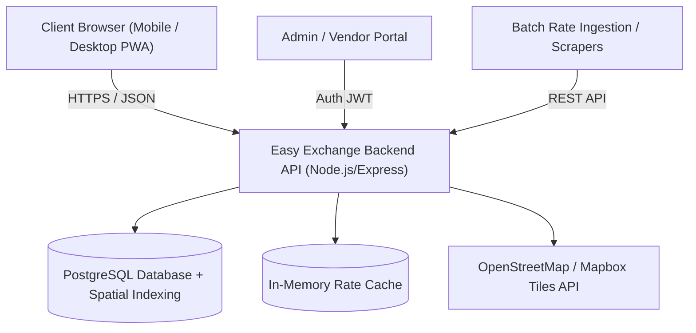

# Software Requirements Specification (SRS)

## Easy Exchange — Currency Exchange Comparison Web App

**Document Version:** 1.0.0  
**Status:** Approved  
**Date:** September 2026  
**Authors:**  
* Ye Zayar Aung (Avax) — `6705140012`  
* Paing Thu Kha Kyaw (Flexx) — `6705140018`  
* Aung Chan Myae (Rowan) — `6705140035`  
**Repository Path:** `Lab_Agile/docs/requirements_specification.md`  

---

## 1. Introduction

### 1.1 Purpose
This Software Requirements Specification (SRS) document details the complete functional and non-functional requirements for the **Easy Exchange** web application. It specifies the system behavior, performance parameters, design constraints, and user interactions required to build a currency exchange comparison and physical shop locator platform.

### 1.2 Scope of the System
Easy Exchange aggregates currency exchange rates across multiple brick-and-mortar money changers, calculates real-time conversion payouts, highlights the most cost-effective exchange options, and guides users to convenient physical branches via interactive mapping.

### 1.3 Definitions, Acronyms, and Abbreviations
* **Base Currency:** The currency an exchanger provides (e.g., selling USD).
* **Target / Quote Currency:** The currency an exchanger receives (e.g., buying THB).
* **Buy Rate (We Buy):** The rate at which the exchange shop buys foreign currency from the customer.
* **Sell Rate (We Sell):** The rate at which the exchange shop sells foreign currency to the customer.
* **Spread:** The difference between the buy rate and the sell rate, representing the shop's profit margin.
* **SRS:** Software Requirements Specification.
* **API:** Application Programming Interface.
* **PWA:** Progressive Web Application.
* **ISO 4217:** International standard defining 3-letter currency codes (e.g., USD, THB, EUR, JPY).

### 1.4 Document Conventions
Requirements are uniquely labeled as:
* `FR-XX`: Functional Requirement
* `NFR-XX`: Non-Functional Requirement
* Priority levels: **Must Have (High)**, **Should Have (Medium)**, **Could Have (Low)** according to the MoSCoW prioritization model.

---

## 2. Overall System Description

### 2.1 Product Perspective & Architecture
Easy Exchange is a modern, modular, cloud-deployed Single-Page Application (SPA) backed by a RESTful API and relational spatial database.

### 2.2 User Classes & Personas

| User Persona | Profile & Behavior | Primary Needs |
| :--- | :--- | :--- |
| **International Student (e.g., Alex)** | Exchanges limited funds monthly; highly price-sensitive to rate spreads. | Needs instant calculation for small-to-medium transfers and counter proximity to university campus. |
| **Global Traveler / Tourist (e.g., Maria)** | First-time visitor needing immediate local cash upon arrival. | Needs mobile map navigation, verified opening hours, and warning against exorbitant airport rates. |
| **Exchange Shop Operator (e.g., Shop Staff)** | Small or medium money exchange counter manager. | Needs a lightweight, authenticated portal to publish updated morning/afternoon exchange board rates. |
| **System Administrator** | Technical custodian maintaining system health and data accuracy. | Needs branch moderation, user oversight, audit logging, and scraper health monitoring. |

### 2.3 Operating Environment
* **Frontend:** Evergreen browsers (Chrome >= 110, Safari >= 16, Firefox >= 110, Edge >= 110) on iOS, Android, macOS, Windows, Linux.
* **Backend Runtime:** Node.js LTS (v20+) or equivalent Python/Go environment.
* **Database:** PostgreSQL 15+ with PostGIS / B-Tree spatial indexing.
* **Hosting:** Cloud platform with TLS/SSL encryption and continuous integration.

---

## 3. Functional Requirements

### 3.1 Module 1: Rate Comparison & Aggregation

* **FR-1.1: Live Side-by-Side Comparison Grid**
  * *Description:* The system MUST display a matrix comparing buy and sell rates for a selected currency pair across all registered exchange shops.
  * *Priority:* Must Have (High)
  * *Inputs:* Selected Base Currency (e.g., USD), Target Currency (e.g., THB).
  * *Outputs:* Sorted list of shops showing Shop Name, Branch, Buy Rate, Sell Rate, Spread, and Last Updated Timestamp.

* **FR-1.2: Multi-Currency Pair Filtering**
  * *Description:* The system MUST allow users to select from at least 8 major international currencies (USD, EUR, JPY, GBP, SGD, CNY, MMK, THB).
  * *Priority:* Must Have (High)

* **FR-1.3: Rate Freshness & Stale Rate Warning**
  * *Description:* The system MUST display the exact timestamp when each shop's rates were last refreshed. If a rate has not been updated within 24 hours, the system MUST display a visual "Stale Rate" warning badge.
  * *Priority:* Must Have (High)

* **FR-1.4: Sorting by Best Value**
  * *Description:* The system MUST allow users to sort the comparison table by highest buy rate, lowest sell rate, smallest spread, or nearest distance.
  * *Priority:* Must Have (High)

---

### 3.2 Module 2: Interactive Currency Calculator

* **FR-2.1: Dynamic Amount Conversion**
  * *Description:* The user MUST be able to enter a numerical transaction amount (e.g., 500 USD), and the system MUST dynamically compute the exact output amount (THB) for each listed exchange shop without requiring a page reload.
  * *Priority:* Must Have (High)

* **FR-2.2: Net Payout Difference Display**
  * *Description:* The calculator MUST calculate and display the monetary difference (savings) between the best available shop and the median market rate.
  * *Priority:* Should Have (Medium)

* **FR-2.3: Bidirectional Conversion (Reverse Calculator)**
  * *Description:* The user MUST be able to switch direction: "I have X foreign currency, how much local currency do I get?" OR "I need Y local currency, how much foreign currency must I bring?".
  * *Priority:* Should Have (Medium)

* **FR-2.4: Denomination Breakdown (Optional)**
  * *Description:* Where shops offer different rates for different bill denominations (e.g., $100 bills vs $1–$5 bills), the calculator SHOULD allow selecting the bill denomination tier.
  * *Priority:* Could Have (Low)

---

### 3.3 Module 3: Best Rate Finder & Recommendation Engine

* **FR-3.1: Best Rate Highlighting**
  * *Description:* The system MUST programmatically determine and tag the top shop offering the maximum payout for the user's selected transaction with a prominent "Best Rate" badge.
  * *Priority:* Must Have (High)

* **FR-3.2: Value vs. Distance Recommendation**
  * *Description:* If the shop with the absolute best rate is far away (> 10 km) but a shop offering 99.5% of that rate is within 500 meters, the system SHOULD suggest the nearby alternative with an "Optimal Convenience" recommendation tag.
  * *Priority:* Should Have (Medium)

---

### 3.4 Module 4: Exchange Shop Finder & Map Integration

* **FR-4.1: Interactive Map Rendering**
  * *Description:* The system MUST embed an interactive map displaying geolocated pin markers for all physical shop counters matching the active filter.
  * *Priority:* Must Have (High)

* **FR-4.2: Geolocation ("Find Near Me")**
  * *Description:* Upon receiving user browser permission, the system MUST retrieve the user's current GPS coordinates and calculate straight-line and road distances to each branch.
  * *Priority:* Must Have (High)

* **FR-4.3: Shop Profile Modal**
  * *Description:* Clicking any map pin or shop name MUST open a drawer or modal displaying:
    * Full branch address and landmarks
    * Current operational status (Open Now / Closed)
    * Operating hours for weekdays and weekends
    * Contact telephone number
    * Accepted payment methods (Cash only, PromptPay/QR, Debit card)
  * *Priority:* Must Have (High)

* **FR-4.4: Navigation External Routing**
  * *Description:* The shop card MUST contain a "Get Directions" action that deep-links to Google Maps / Apple Maps using latitude and longitude coordinates.
  * *Priority:* Must Have (High)

---

### 3.5 Module 5: Shop & Rate Administration

* **FR-5.1: Authenticated Rate Management Portal**
  * *Description:* Verified shop managers and system administrators MUST be able to log in via JWT credentials to update currency rates for their branches.
  * *Priority:* Must Have (High)

* **FR-5.2: Batch Rate Update / CSV Upload**
  * *Description:* Administrators MUST be able to update all currency rates at once via a quick spreadsheet/CSV upload or tabular inline editor.
  * *Priority:* Should Have (Medium)

* **FR-5.3: Rate Change Audit Logging**
  * *Description:* Every rate modification MUST record the user ID, previous rate, new rate, timestamp, and client IP address in an immutable audit log.
  * *Priority:* Should Have (Medium)

---

### 3.6 Module 6: User Preferences & Customization

* **FR-6.1: Local Storage Bookmarks**
  * *Description:* The system MUST allow users to pin favorite currency pairs (e.g., USD/THB, EUR/THB) so they persist on subsequent visits without requiring mandatory account creation.
  * *Priority:* Should Have (Medium)

* **FR-6.2: Target Rate Alerts (Future Scope)**
  * *Description:* Registered users MAY configure an email alert threshold (e.g., "Alert me when JPY/THB drops below 0.23").
  * *Priority:* Could Have (Low)

---

## 4. Non-Functional Requirements (NFR)

### 4.1 Performance & Latency
* **NFR-PERF-01 (API Response Time):** The backend API MUST return cached exchange rate comparison payloads within 200 ms under normal load.
* **NFR-PERF-02 (Frontend First Contentful Paint):** The web application MUST achieve a First Contentful Paint (FCP) of under 1.5 seconds on standard 4G mobile connections.
* **NFR-PERF-03 (Calculation Throughput):** Client-side calculator recomputation MUST execute with zero perceptible latency (< 16 ms, 60 FPS).
* **NFR-PERF-04 (Concurrent Users):** The system architecture MUST support at least 500 concurrent active users without degradation.

### 4.2 Security & Integrity
* **NFR-SEC-01 (Transport Encryption):** All communications between client, server, and third-party APIs MUST be secured via HTTPS (TLS 1.3).
* **NFR-SEC-02 (Input Validation & Sanitization):** All inputs (currency codes, amounts, coordinates, auth tokens) MUST be validated against strict schemas to eliminate SQL Injection, Cross-Site Scripting (XSS), and prototype pollution.
* **NFR-SEC-03 (Rate Limiting):** Public read endpoints MUST be rate-limited to 60 requests per IP per minute to prevent denial-of-service and unauthorized scraping.
* **NFR-SEC-04 (Role-Based Access Control):** Admin and vendor endpoints MUST enforce strict role-based access control (RBAC) via cryptographically signed JSON Web Tokens (JWT).

### 4.3 Usability & Accessibility
* **NFR-USA-01 (Responsive Design):** The UI MUST adapt seamlessly to screen widths ranging from 360px (mobile) to 2560px (desktop 4K).
* **NFR-USA-02 (Accessibility Compliance):** The web app MUST comply with WCAG 2.1 Level AA standards, ensuring high-contrast color ratios, descriptive alt tags, and full keyboard navigation.
* **NFR-USA-03 (Zero Mandatory Login):** Core user features (rate comparison, calculator, map lookup) MUST NOT force account creation.

### 4.4 Availability & Reliability
* **NFR-REL-01 (Uptime):** The system MUST maintain 99.5% service availability during business operating hours (08:00 to 22:00 local time).
* **NFR-REL-02 (Map Fallback):** If third-party map tiles fail to load, the system MUST gracefully fall back to a text-based list view of shops with distance indicators without crashing.

---

## 5. System Interface Requirements

### 5.1 User Interface (UI) Wireframe Flow
1. **Header:** Currency Pair Selector, Search Bar, Theme Toggle (Light/Dark).
2. **Main Section (Tabbed / Split View):**
   * *View A: Comparison Table* (Rate grid, Best Rate highlights, Shop names, Distance).
   * *View B: Interactive Map* (Pins with price tags, shop popup cards).
3. **Interactive Drawer:** Currency conversion calculator recalculating values across all shops in real time.
4. **Footer:** Disclaimer notices, data freshness notes, academic project attribution.

### 5.2 API Interface Specifications
The backend exposes RESTful endpoints:
* `GET /api/v1/currencies` — Retrieve all active currencies.
* `GET /api/v1/rates/compare?base={USD}&target={THB}&lat={x}&lng={y}` — Retrieve side-by-side rates with computed distances.
* `GET /api/v1/shops` — Retrieve list of exchange shops and branch locations.
* `GET /api/v1/shops/:id` — Retrieve detailed profile, branch hours, and current board rates.
* `POST /api/v1/auth/login` — Authenticate admin/shop operator.
* `PUT /api/v1/rates/batch` — Bulk update branch exchange rates.

---

## 6. Requirements Traceability Matrix

| Problem Identified in Design Thinking | Proposed Feature | SRS Requirement ID |
| :--- | :--- | :--- |
| Rate Comparison Difficulty | Side-by-Side Comparison Matrix | `FR-1.1`, `FR-1.2`, `FR-1.4` |
| Calculation Confusion | Real-time Dynamic Currency Calculator | `FR-2.1`, `FR-2.2`, `FR-2.3` |
| Finding Convenient Locations | Interactive Map & GPS Locator | `FR-4.1`, `FR-4.2`, `FR-4.4` |
| Time Consumption | Best Rate Tagging & Fast Sorting | `FR-1.4`, `FR-3.1`, `FR-3.2` |
| Fear of Inaccurate/Outdated Rates | Freshness Timestamps & Stale Warnings | `FR-1.3`, `NFR-REL-01` |
